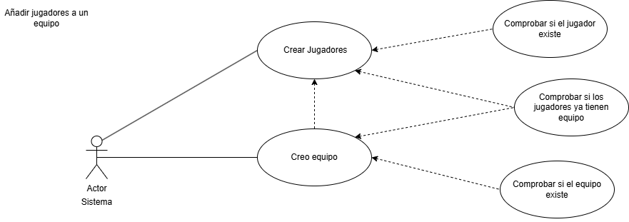
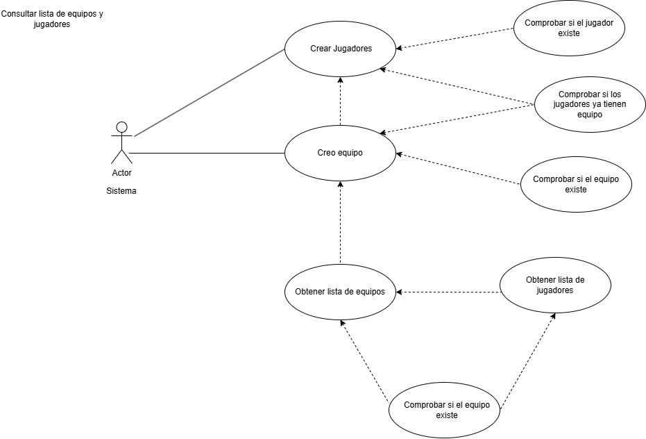
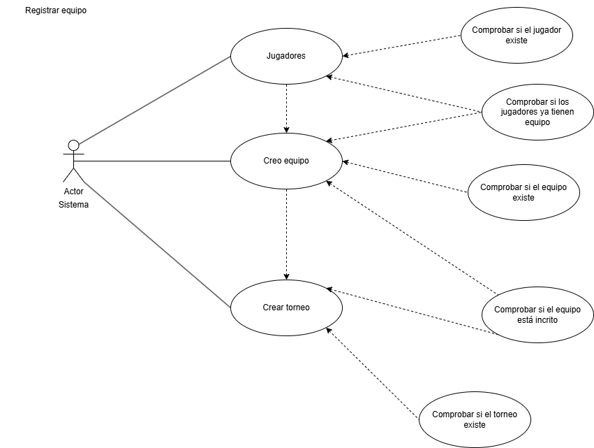
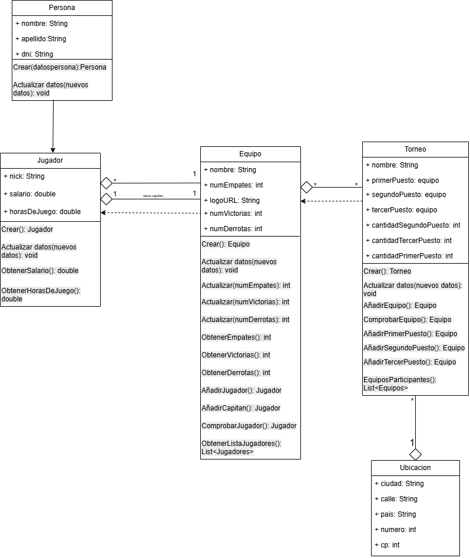

# Sistema de Gestión de Torneos de eSports 

## Autor 
Nahir Carolina Torres

Carol878 

## Descripción del Proyecto 

Link al repositorio del proyecto: https://github.com/Carol878/torneo-esports-uml.git

Este proyecto implementa un sistema de gestión de torneos de eSports utilizando UML para el modelado y Java para la implementación.

## Diagramas UML 
### Diagrama de Casos de Uso 

### Diagrama de Clases 
 

## Estructura del Proyecto 
torneo-esports-uml/ ├── src/ 

│ ├── es/empresa/torneo/ 

│ │ ├── modelo/ 

│ │ ├── control/ 

│ │ ├── vista/ 

│ │ ├── Main.java 

├── diagrams/ 

│ ├── casos-uso.png 

│ ├── clases.png 

├── README.md 

├── .gitignore

## Instalación y Ejecución 
1. Clonar el repositorio:
`git clone https://github.com/usuario/torneo-esports-uml.git`

## Justificación del diseño

Se ha optado por una arquitectura orientada a casos de uso, donde el actor principal interactúa con el sistema para gestionar jugadores, equipos y torneos.

Cada funcionalidad relevante se encapsula en casos de uso separados, siguiendo el principio de responsabilidad única:

Crear jugadores

Crear equipos

Consultar listas de equipos o jugadores

Registrar equipos en torneos

Validar existencia de entidades (jugadores, equipos, torneos)

Esta separación clara favorece:

Mantenibilidad

Escalabilidad

Legibilidad

2. Organización de las clases:

Persona:

-Representa a una persona genérica con atributos básicos como nombre, apellido y DNI.

-Permite que esta clase sirva como base para otras clases más especializadas en el futuro (como Jugador).

-Se enfoca solo en los datos personales, separando responsabilidades.

Jugador:

-Hereda de persona.

-Añade atributos específicos como nick, salario y horas de juego.

-Se vincula a Equipo con una relación de "muchos jugadores pertenecen a un equipo", permitiendo también distinguir al capitán.

Equipo:

-Administra jugadores, resultados de partidos (victorias, derrotas, empates) y su propia información como nombre y logo.

-Es responsable de añadir jugadores, establecer capitanes y llevar las estadísticas del equipo.

-Se relaciona de manera directa con Torneo ya que un torneo tiene varios equipos participantes.

Torneo:

-Coordina la participación de varios equipos.

-Lleva el control de los primeros tres puestos y la cantidad de veces que un equipo ocupa cada posición.

-Facilita la organización de competiciones agregando y comprobando equipos participantes.

Ubicación:

-Maneja la información geográfica de los torneos, como ciudad, país, calle, número y código postal.

-Asocia una ubicación a un torneo de manera 1 a 1, reforzando la coherencia de que un torneo ocurre en un solo lugar.

3. Principios de diseño aplicados

-Alta cohesión y bajo acoplamiento: Cada clase o módulo tiene alta cohesión en sus tareas, y las dependencias son controladas (por ejemplo, validar existencia no implica almacenar referencias innecesarias).

-Claridad y separación de conceptos: Cada clase tiene una única responsabilidad concreta.

-Relaciones naturales: Los jugadores forman equipos, los equipos compiten en torneos.

-Facilidad de mantenimiento y escalabilidad: Es sencillo añadir funcionalidades nuevas (como nuevos tipos de torneos, diferentes tipos de jugadores, etc.).

-Reutilización: Las clases son reutilizables en diferentes contextos, por ejemplo, un jugador podría pertenecer a diferentes torneos a lo largo del tiempo.

-Adaptabilidad: Permite la fácil adaptación para manejar diferentes escenarios, como torneos internacionales, distintos formatos de competencia, etc.

Conclusión:

Se eligió esta estructura porque:

Facilita la comprensión y evolución del sistema: cualquier funcionalidad nueva puede integrarse fácilmente.

Minimiza errores de integridad (por las validaciones antes de operaciones críticas).

Promueve buenas prácticas: modularidad, bajo acoplamiento, alta cohesión.

Este diseño es especialmente sólido para proyectos donde la gestión de entidades (usuarios, equipos, torneos) es el eje central.

## Conclusiones 

Realizar un trabajo de estas características me permitió consolidar conceptos fundamentales de programación, como la correcta estructuración de casos de uso, la identificación de entidades principales, y la aplicación de principios de diseño como la cohesión y el bajo acoplamiento. Además, fortalecí mi capacidad para modelar sistemas de manera clara y organizada, lo que resulta clave para el desarrollo de soluciones escalables y mantenibles.

